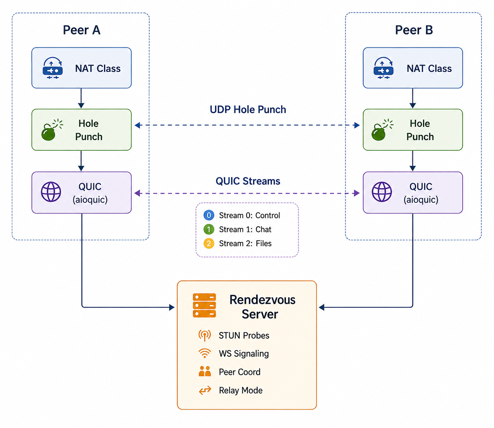
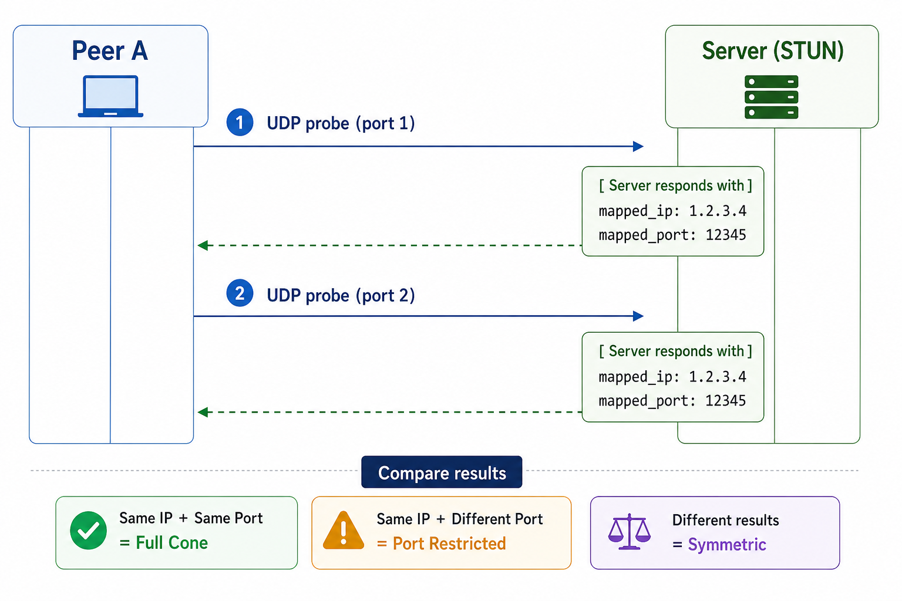
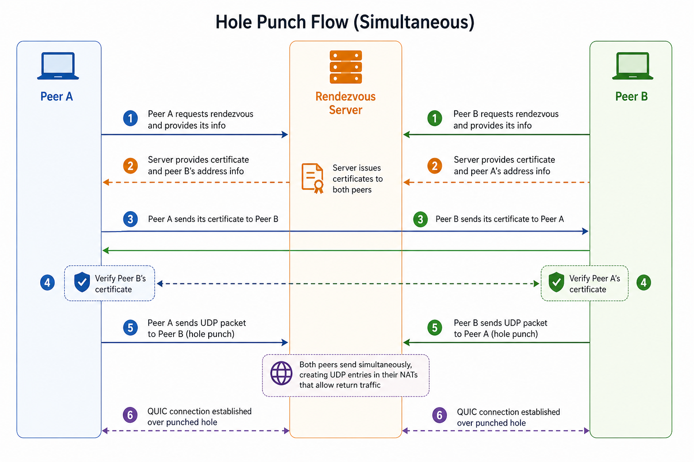
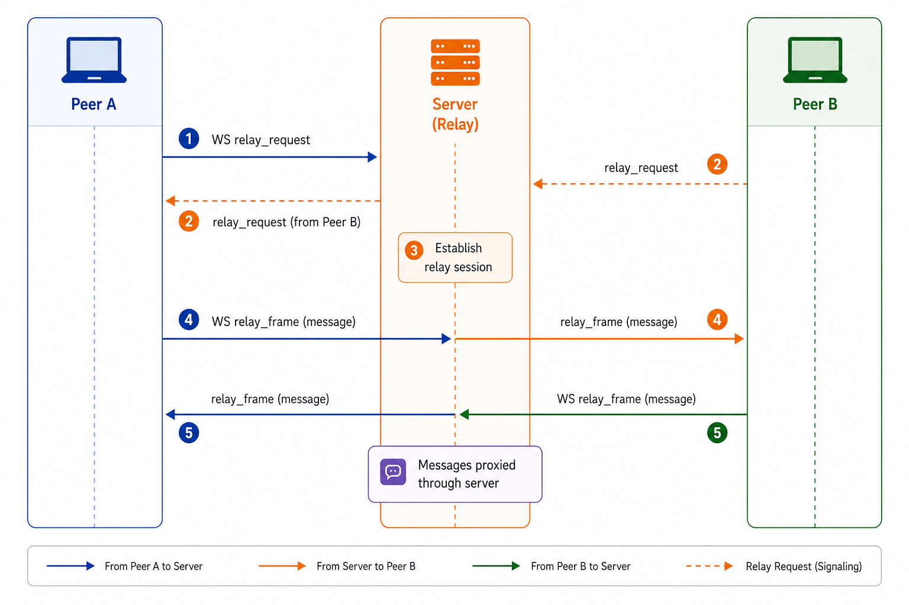

# NAT Traversal with UDP Hole Punching

A minimal NAT traversal implementation using UDP hole punching with QUIC transport, relay fallback, and metrics.

## Features

- **NAT Classification**: Detects full cone, restricted cone, port-restricted, and symmetric NAT
- **UDP Hole Punching**: Simultaneous hole punching with retry logic
- **QUIC Transport**: Using `aioquic` with 0-RTT session resumption
- **Relay Fallback**: WebSocket-based relay when hole punching fails
- **TLS Authentication**: QUIC built-in TLS 1.3 certificate-based authentication
- **Metrics Dashboard**: Real-time metrics via HTTP endpoint

## Architecture
<p align="center">
  
</p>

## Project Structure

```
nat-traversal-udp-hole-punching-over-quic/
├── server/
│   └── rendezvous.py      # STUN probes + WebSocket signaling + tokens
├── peer/
│   ├── nat_classifier.py  # NAT type detection
│   ├── hole_punch.py      # UDP hole punching logic
│   ├── quic_peer.py       # QUIC with aioquic + 0-RTT
│   ├── relay.py           # WebSocket relay fallback
│   ├── metrics.py         # Metrics collection + HTTP endpoint
│   └── main.py            # Main orchestrator
├── common/
│   └── auth.py            # Token authentication module
├── certs/                 # TLS certificates (generated)
├── scripts/
│   └── gen_certs.py       # Certificate generation
└── requirements.txt
```

## Setup

### Install dependencies and generate certificates

```bash
pip install -r requirements.txt
python scripts/gen_certs.py
```

### Start Rendezvous Server:

```bash
python server/rendezvous.py --host 0.0.0.0
```

Server listens on:
- UDP 3478, 3479: STUN probes
- WebSocket 8765: Signaling


### Start Peer A (Listener):

```bash
python peer/main.py --server <server_ip> --peer-id A --metrics-port 9090
```

### Start Peer B (Connector):

```bash
python peer/main.py --server <server_ip> --peer-id B --connect A --metrics-port 9091
```

### Local usage commands (inside peer prompt)

```text
hello
/stats                # show connection stats
/file <file_path>     # send file (direct mode only)
/quit                 # quit the peer
```

### Local metrics endpoints

```bash
curl http://localhost:9090/metrics
curl http://localhost:9091/metrics
curl http://localhost:9090/metrics/summary
```

### Docker setup and run

```
docker compose down --remove-orphans
docker compose up -d --build rendezvous alice
docker compose run --rm bob
```

## Docker Compose: Exact File Transfer Test

- `./docker_data/bob_send` -> `/send` inside Bob container (source files to send)
- `./docker_data/alice_inbox` -> `/app/received_files` inside Alice container (received files)

Received files are saved under:

- `/app/received_files/<peer_id>/<filename>` inside container
- `docker_data/alice_inbox/<peer_id>/<filename>` on host


### Important note about relay mode

If logs show relay mode (`Connected ... (relay mode)`), 
`/file` is intentionally unavailable.
File transfer works only in direct QUIC mode.

## Usage

### Command Line Options

```bash
python peer/main.py [OPTIONS]

Options:
  --peer-id TEXT       Unique peer identifier (default: random)
  --server TEXT        Rendezvous server address (required)
  --ws-port INT        WebSocket port (default: 8765)
  --stun-port-1 INT    First STUN port (default: 3478)
  --stun-port-2 INT    Second STUN port (default: 3479)
  --metrics-port INT   Metrics HTTP port (default: 9090)
  --connect TEXT       Target peer ID to connect to
  --cert TEXT          TLS certificate file
  --key TEXT           TLS private key file
```

### Metrics

Access metrics at `http://localhost:9090/`:
- `/` - HTML dashboard
- `/metrics` - Raw JSON
- `/metrics/summary` - Condensed summary

## NAT Classification

The classifier sends UDP probes to both STUN ports and compares mapped addresses:

| Probe 1 | Probe 2 | Classification |
|---------|---------|----------------|
| Same IP + Same Port | Same IP + Same Port | Full Cone |
| Same IP + Different Port (small diff) | - | Port Restricted |
| Same IP + Different Port (large diff) | - | Symmetric |
| Different IP | - | Symmetric |

## Hole Punching Strategy

1. Both peers receive each other's mapped address via WebSocket
2. Simultaneously send UDP packets every 200ms
3. Continue for up to 3 seconds
4. First peer to receive response confirms the hole

If both peers have symmetric NAT, hole punching is skipped and relay mode is used.

## QUIC Streams

| Stream ID | Purpose | Notes |
|-----------|---------|-------|
| 0 | Control/Ping | RTT measurement every 5s |
| 4 | Chat/Data | Text messages |
| 8 | File Transfer | Binary data (disabled in relay) |

## 0-RTT Resumption

Session tickets are cached in `.session_tickets_<peer_id>.pkl`. Subsequent connections reuse tickets for faster handshakes.

Metrics show:
- `is_0rtt: true` when resumption succeeded
- Connection time difference: ~50-100ms savings

## Relay Mode

When hole punching fails:
1. Both peers connect to server via WebSocket
2. Server proxies messages between them
3. 4KB payload limit (no file transfers)
4. Metrics flag `using_relay: true`

## QUIC TLS Authentication

Connection authentication flow:
1. Peers exchange candidate addresses via rendezvous server signaling
2. Peers establish QUIC directly over the punched UDP path
3. QUIC performs built-in TLS 1.3 handshake with certificate verification
4. Connection proceeds only if certificate validation succeeds

## Real-World Scenario

To test with actual NAT:

1. **Deploy server to VPS**
   ```bash
   ssh user@vps.example.com
   python3 server/rendezvous.py --host 0.0.0.0 --ws-port 8765
   ```

2. **Run peers behind different NATs**
   ```bash
   python3 peer/main.py --server vps.example.com --peer-id alice
   python3 peer/main.py --server vps.example.com --peer-id bob --connect alice
   ```

3. **Observe results**
   - With full cone NAT: Hole punch succeeds, direct P2P
   - With port-restricted NAT: Hole punch succeeds in most cases
   - With symmetric NAT: Falls back to relay
   - With symmetric-to-symmetric: Always uses relay

## Architecture Diagrams

### NAT Detection Flow

<p align="center">
  
</p>

### Hole Punch Flow (Simultaneous)

<p align="center">
  
</p>

### Relay Fallback Flow

<p align="center">
  
</p>

## Performance Notes

### Direct P2P (Hole Punch Success)
- Latency: Typically < 50ms (depends on network)
- Throughput: Limited only by network capacity
- Best case: Both peers have full-cone or restricted-cone NAT

### Relay Mode
- Latency: + 50-100ms (server hop overhead)
- Throughput: Limited by server bandwidth
- Used when: Symmetric NAT detected or hole punch fails
- Payload: Limited to 4KB per message (no file transfers)

### 0-RTT Resumption
- On reconnect: 10-20ms faster than initial handshake
- Uses cached session tickets from `~/.session_tickets_<peer_id>.pkl`
- Visible in metrics: `"is_0rtt": true`

## Troubleshooting

### "Probe error: [WinError 10022]"
- Windows socket configuration issue
- Fix: Ensure UDP ports 3478, 3479 are not in use
- Alternative: Use different ports with `--stun-port-1` and `--stun-port-2`

### "Failed to get responses from STUN server"
- Server not running or unreachable
- Check: Server is listening on correct host/port
- Test: `telnet <server> 8765` for WebSocket port

### "Hole punch FAILED"
- Expected on localhost (both peers same IP)
- Expected with symmetric-to-symmetric NAT
- Normal fallback: Relay mode is activated

### "Connection timeout"
- Firewall blocking UDP ports
- Check: UFW, iptables, Windows Firewall
- Allow: UDP traffic on configured ports

### "File transfer complete" in logs but file not found on host
- Verify you rebuilt after latest changes: `docker compose up -d --build rendezvous alice`
- Verify expected host path: `docker_data/alice_inbox/alice/<filename>`
- Verify connection mode is direct, not relay
- Check Alice logs: `docker compose logs --tail=120 alice`

## License

MIT
